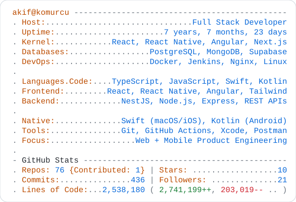
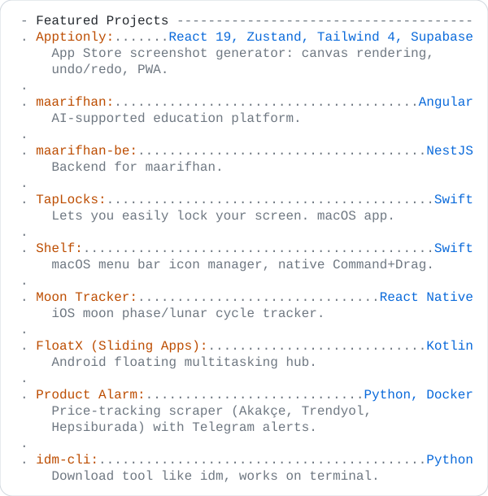

  <a href="https://github.com/akifkomurcu">
    <picture>
      <source media="(prefers-color-scheme: dark)" srcset="./dark_mode.svg">
      
    </picture>
  </a>

---

### 🛠️ Skills & Tools

  
  
  
  
  
  
  
  
  
  

---

  <picture>
    <source media="(prefers-color-scheme: dark)" srcset="./projects_dark.svg">
    
  </picture>

---

### 📫 Connect

  
  

  

